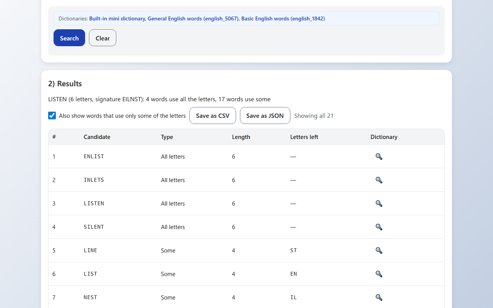
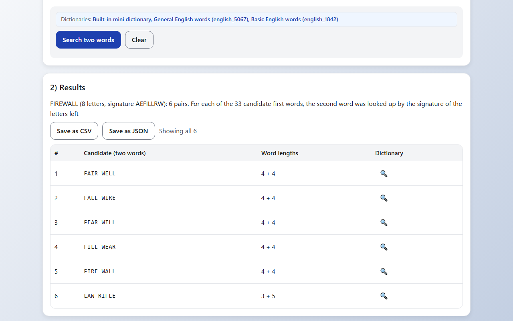
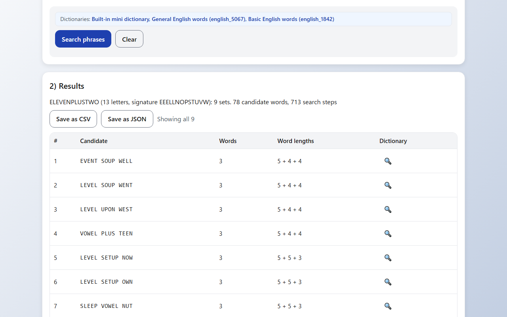
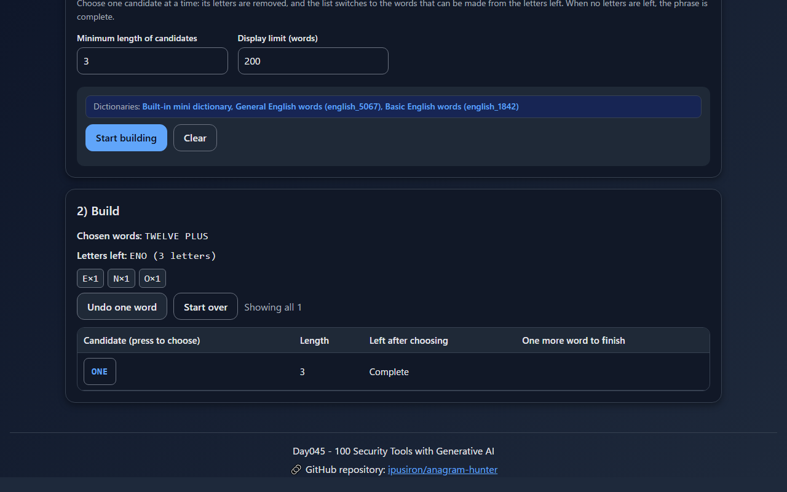
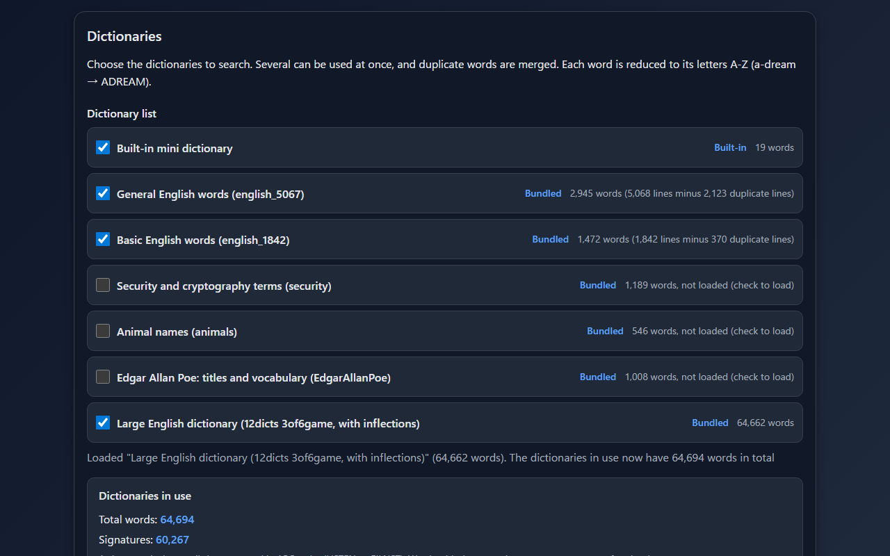

English · [日本語](README.md)

# Anagram Hunter - Anagram Search Tool with Dictionary Signatures


[](https://ipusiron.github.io/anagram-hunter/)

**Day045 - 100 Security Tools with Generative AI**

Anagram Hunter is a web tool that finds English words (anagrams) that can be made by rearranging the input letters. Using an index of "signatures" (a word's letters sorted in ABC order), it lists one-word anagrams and the pairs and phrases that use up exactly the input letters. It also has a builder mode for choosing one word at a time and a comparison of two strings. The input and the dictionaries are handled only inside your browser and are never sent anywhere.

---

## 🌐 Demo

👉 **[https://ipusiron.github.io/anagram-hunter/](https://ipusiron.github.io/anagram-hunter/)**

You can try it directly in your browser.

---

## 📸 Screenshots

>
>
>*Words made from LISTEN: four words that use all the letters, and the letters left by words that use only some*

>
>
>*Pairs of words that use up exactly the letters of FIREWALL (all six pairs)*

>
>
>*Phrases of up to three words from the letters of ELEVEN PLUS TWO, including TWELVE PLUS ONE*

>
>
>*TWELVE and PLUS have been chosen; choosing ONE from the letters left (ENO) completes the phrase (dark mode)*

>
>
>*The bundled dictionaries and their word counts without duplicates, with the large English dictionary loaded (dark mode)*

---

## ✨ Features

- One word: lists the words that use all the input letters (e.g. LISTEN → SILENT, ENLIST, INLETS) and the words that use only some of them. Words that use only some letters show the letters left over
- Two words: finds every pair of words that uses up exactly the input letters (e.g. DORMITORY → DIRTY ROOM). Each pair is counted once
- Phrase: finds sets of up to five words (e.g. ELEVEN PLUS TWO → TWELVE PLUS ONE). You can set the maximum number of words, the length of each word, words to include, words to exclude, and whether the same word may be repeated
- Builder: choose one candidate at a time, and the screen switches to the letters left (the count of each letter), the words that can be made from them, and the words that finish the phrase in one more step. Undo one word or start over
- Compare: checks whether two strings are anagrams of each other, shows the letters found in only one of them, and whether one can be made from the letters of the other (no dictionary is used)
- Filters: minimum and maximum word length, starts with, ends with, contains, and letter positions (as in `S?L???`, where ? is any one letter). Display limit (200 by default)
- Dictionaries: choose the built-in mini dictionary and the six bundled dictionaries from a list. Add your own dictionary from a text file or by pasting. Several dictionaries can be used at once, and duplicate words are merged
- Input normalization: only the letters are used, in upper case. Full-width letters (ＬＩＳＴＥＮ) and letters with accents (café → CAFE) are accepted, and the number of ignored characters is shown
- Export: save results as CSV (with a BOM so that Excel opens it correctly) and JSON. All results are exported regardless of the display limit
- Look up words: the 🔍 link opens the search results of Wiktionary on the English screen, or Eijiro on the Japanese screen, in a new tab
- Screen: Japanese and English, light and dark modes (following the OS setting, with a button to switch), tabs that work with the keyboard, and no horizontal overflow even on a 320 px wide smartphone

---

## 📖 Usage

1. On the "One word" tab, enter letters (e.g. `LISTEN`) and press "Search" (Enter also works)
2. Turn on "Also show words that use only some of the letters" to list words made from part of the input and the letters they leave
3. The "Two words" tab finds pairs of words that use up exactly the letters
4. The "Phrase" tab also finds sets of three or more words. If there are too many candidates, lower the maximum number of words, raise the minimum length of each word, or add a word to include
5. On the "Builder" tab, enter letters, press "Start building", and press candidate words to choose them one at a time. When no letters are left, the phrase is complete
6. On the "Compare" tab, enter two strings and press "Compare"
7. On the "Dictionaries" tab, check the dictionaries to use. A bundled dictionary is loaded when you check it. Add your own list of words (one per line) from a file or by pasting
8. Save the results with "Save as CSV" or "Save as JSON"

When opened from the public version (HTTPS), the two general English dictionaries (english_5067 and english_1842) are loaded from the start. The buttons at the top right switch between Japanese and English and between light and dark.

---

## 🔗 Passing letters in the URL

Add `?text=` to the URL to open the tool with those letters in the input field; the search runs after the bundled dictionaries are loaded. Use `&tab=` to choose the tab (`single`, `two-word`, `phrase`, `builder` or `compare`; the default is one word). This is useful for opening the tool with letters from another tool or an article.

- `https://ipusiron.github.io/anagram-hunter/?text=DORMITORY&tab=two-word`
- `https://ipusiron.github.io/anagram-hunter/?text=ELEVEN%20PLUS%20TWO&tab=phrase`
- With `compare`, the letters only go into field A; enter B and then compare
- The language can be chosen with `?lang=ja` or `?lang=en`

---

## 📚 Bundled dictionaries

The text files in `wordlists/` (one word per line). The word counts are after reducing each line to its letters and removing duplicates.

| File | Contents | Lines | Words | Used from the start |
|---|---|---|---|---|
| english_5067.txt | General English words | 5,068 | 2,945 | ○ |
| english_1842.txt | Basic English words (in order of frequency) | 1,842 | 1,472 | ○ |
| security.txt | Security and cryptography terms | 1,189 | 1,189 | |
| animals.txt | Animal names | 695 | 546 | |
| EdgarAllanPoe.txt | Edgar Allan Poe: titles and vocabulary | 1,197 | 1,008 | |
| 12dicts-3of6game.txt | Large English dictionary (12dicts, with inflections) | 64,662 | 64,662 | |

- The built-in mini dictionary (19 words, anagram examples such as LISTEN, STONE and TEAM) can be used without loading anything
- Hyphens in titles are removed and each title is treated as one word (`a-dream` and `adream` become the same word)
- The large English dictionary is the 3of6game list from 12dicts (6.0.2), compiled by Alan Beale, who explicitly released it to the public domain. It is a list for word games that includes plurals and verb forms and excludes proper names, abbreviations and phrases. Apart from converting the line endings to LF, it is the original file; the source and SHA-256 are in [wordlists/12dicts-NOTICE.md](wordlists/12dicts-NOTICE.md)
- With only the large English dictionary, DORMITORY gives three pairs: DIRT ROOMY, DIRTY MOOR and DIRTY ROOM. It finds many pairs that the small bundled dictionaries alone cannot

---

## 🔬 How the search works

Anagrams become the same string when their letters are sorted in ABC order (LISTEN → EILNST, SILENT → EILNST). This string is called the signature, and when a dictionary is loaded, an index from each signature to its words is built.

- One word: the count of each input letter (the 26 counts of A to Z, a frequency vector) tells whether each dictionary word can be made. The words that use all the letters are those whose signature equals the input's
- Two words: choosing the first word fixes the letters needed for the second (the letters left). Looking up the signature of the letters left finds every second word. One pass over the dictionary gives an exhaustive search with nothing missed
- Phrase: words are sorted from longest to shortest, and only words after the previously chosen one are taken, so sets that differ only in word order are not repeated. The last word is looked up by its signature, and each intermediate step passes on only the candidates that can still be made from the letters left. The search stops with a notice when it reaches 5,000 sets, 2,000,000 steps or 3 seconds

With the dictionaries used from the start (built-in + english_5067 + english_1842, 3,233 words), these pairs are found.

| Input | Pairs |
|---|---|
| DORMITORY | DIRTY ROOM |
| DEBITCARD | CARD DEBIT, BAD CREDIT, BAD DIRECT |
| SCHOOLMASTER | MASTER SCHOOL, SCHOOL STREAM, CLASSROOM THE |
| FIREWALL | FAIR WELL, FALL WIRE, FEAR WILL, FILL WEAR, FIRE WALL, LAW RIFLE |

For phrases (each word at least 3 letters, no repeated words), these sets are found.

| Input | Conditions | Phrases |
|---|---|---|
| ELEVENPLUSTWO | Up to 3 words | EVENT SOUP WELL, LEVEL SOUP WENT, LEVEL UPON WEST, VOWEL PLUS TEEN, LEVEL SETUP NOW, LEVEL SETUP OWN, SLEEP VOWEL NUT, TWELVE PLUS ONE, TWELVE POLE SUN |
| ELEVENPLUSTWO | Up to 3 words, include TWELVE | TWELVE PLUS ONE, TWELVE POLE SUN |
| CYBERSECURITY | Up to 4 words | CITY CRY RUB SEE, CURE BIT CRY YES, REST BUY CRY ICE |

Sets are listed with fewer words first, then with the longest shortest word first. The steps and the cost are explained in [ALGORITHM.md](ALGORITHM.md) (in Japanese).

---

## 🎯 Use cases

- Learning transposition ciphers: a transposition cipher only moves letters around, so the ciphertext is an anagram of the plaintext. Rearrange a short ciphertext with the phrase search or the builder to find plaintext candidates, and see how columnar transposition works in [Columnar CipherLab (Day043)](https://ipusiron.github.io/columnar-cipherlab/)
- CTF and puzzle questions: check hints of the type "rearrange the words of the question to get the answer" with one word, two words or phrases. Question setters can check whether the answer has other rearrangements (alternative solutions)
- OSINT practice: use "Compare" to check whether a handle or pen name is a rearrangement of another name, and paste a list of candidate names as a dictionary to search. A match is not proof that two names belong to the same person; it is only one clue
- Making anagrams by hand: crossword and word-game makers can use the builder to choose one word at a time while watching the letters left and the words that finish the phrase in one more step
- English classes and self-study: a vocabulary game of finding the words in a word (LISTEN gives 21 words). The letters left help you think of the next word
- Computing and algorithm classes: see the difference between brute force and an index. The number of candidate first words (two words) and the number of search steps (phrases) appear above the results
- Writing and hobbies: create pen names, character names and team names from the letters of an original name. It also works for a wedding game of rearranging the couple's names
- Naming at work: produce candidate product or project names from the letters of a company name or another word (check trademarks separately)
- With your own glossary: paste a technical or internal glossary and search it. The dictionaries never leave the browser, so unpublished names can be used too
- Poe and ciphers: search the bundled Poe titles and vocabulary for rearrangements of the titles. Poe made a cipher the subject of his short story "The Gold-Bug", and the list can be read together with classical cipher tools such as [Cipher Clairvoyance (Day044)](https://ipusiron.github.io/cipher-clairvoyance/)

---

## 🔒 Security and privacy

- The letters you enter and the dictionaries you load are handled only inside the browser. Nothing is sent to or stored on a server (loaded dictionaries disappear when you close the page)
- A Content Security Policy (meta) limits scripts, styles and connections to the same site. No inline scripts or event handlers are used
- Dictionary names (file names) and results are always put on the screen with `textContent` (never interpreted as HTML)
- Bundled dictionaries are read only from the files in the list. Your own dictionaries come from file selection or pasting (no arbitrary URL is read). `?text=` in the URL only fills the input field and is cut to 400 characters
- Files to load are limited to 10 MB and 500,000 words
- Links to Wiktionary and Eijiro open with `rel="noopener noreferrer"` and send no referrer
- Only the choices of language and theme are saved in localStorage

---

## ⚠️ Notes and limitations

- Only the letters A to Z are handled. Japanese (kana) anagrams are not supported
- The words found depend on the dictionaries. The five small bundled dictionaries have 5,214 words in total (including the built-in mini dictionary); adding the large English dictionary (64,662 words) greatly increases the candidates. Proper names are not found
- Results are not sorted by how common the words are. Whether a set makes sense is for you to judge
- Phrases have up to five words. With a large dictionary or long input, the search may reach its limits (5,000 sets, 2,000,000 steps or 3 seconds); sets with many short words may then be missing
- Opened directly as a file (file://), the tool does not start in Chrome or Edge (they cannot load ES modules). It starts in Firefox, but the bundled dictionaries cannot be loaded. Open it over HTTP as described in "Requirements" below

---

## 🧪 Tests

The logic (`js/anagram-core.js` and others) is written as modules that do not depend on the DOM and is checked with Node.js's built-in test runner (`node:test`). There are no dependencies.

```bash
npm test
```

- Node.js 22 or later
- GitHub Actions runs the tests automatically on every push and pull request
- The tests check that the two-word search returns the same pairs as brute force, that the phrase search limited to two words matches the two-word search, the word counts of the bundled dictionaries, the SHA-256 of the large English dictionary, and the tables in this README and the Japanese README
- They also check the CSP, labels and tab roles in index.html, the color contrast (4.5:1 or more in both light and dark), and that the Japanese and English texts match

---

## 📁 Directory structure

```
anagram-hunter/
├── .github/                  # GitHub settings
│   └── workflows/            # GitHub Actions workflows
│       └── test.yml          # Runs npm test on pushes and pull requests
├── assets/                   # Images
│   ├── en/                   # Screenshots for the English README
│   │   ├── screenshot.png    # One word (English screen)
│   │   ├── screenshot2.png   # Two words (English screen)
│   │   ├── screenshot3.png   # Phrase (English screen)
│   │   ├── screenshot4.png   # Builder (English screen, dark)
│   │   └── screenshot5.png   # Dictionaries (English screen, dark)
│   ├── favicon.svg           # Favicon
│   ├── screenshot.png        # Screenshot (one word, Japanese screen)
│   ├── screenshot2.png       # Screenshot (two words, Japanese screen)
│   ├── screenshot3.png       # Screenshot (phrase, Japanese screen)
│   ├── screenshot4.png       # Screenshot (builder, Japanese screen, dark)
│   └── screenshot5.png       # Screenshot (dictionaries, Japanese screen, dark)
├── js/                       # Modules other than the page script
│   ├── anagram-core.js       # Search logic (normalization, signatures, words, pairs, phrases, compare, CSV)
│   ├── file-check.js         # Notice when the tool cannot start from file://
│   ├── i18n.js               # Choosing and switching the screen language (Japanese and English)
│   ├── messages.js           # Screen texts (Japanese and English)
│   ├── params.js             # Reads ?text= and ?tab= from the URL
│   ├── tabs.js               # Tab switching (including keyboard operation)
│   ├── theme-init.js         # Applies the theme at the very start of loading
│   ├── theme.js              # Light and dark switching
│   └── wordlists.js          # Built-in mini dictionary and the list of bundled dictionaries
├── test/                     # Tests (node:test)
│   ├── contrast.test.js      # Color contrast and sizes of inputs and controls
│   ├── core.test.js          # Normalization, signatures, filters, words, pairs, CSV
│   ├── format.test.js        # Line length, control characters, minimum line counts
│   ├── html.test.js          # CSP, element ids, tab roles, labels
│   ├── i18n.test.js          # Japanese and English keys, no Japanese in English, initial language
│   ├── messages.test.js      # Where texts are kept and their keys
│   ├── params.test.js        # Reading ?text= and ?tab=
│   ├── phrase.test.js        # Phrases, letter positions, comparison, large dictionary
│   ├── readme.test.js        # README tables, structure, tree and images (Japanese and English)
│   └── wordlists.test.js     # Bundled dictionary counts and known answers
├── wordlists/                # Bundled dictionaries (one word per line)
│   ├── 12dicts-3of6game.txt  # Large English dictionary (12dicts 3of6game, public domain)
│   ├── 12dicts-NOTICE.md     # Source, license and SHA-256 of 12dicts
│   ├── EdgarAllanPoe.txt     # Edgar Allan Poe: titles and vocabulary
│   ├── animals.txt           # Animal names
│   ├── english_1842.txt      # Basic English words
│   ├── english_5067.txt      # General English words
│   └── security.txt          # Security and cryptography terms
├── .gitignore                # Git ignore settings
├── .nojekyll                 # Tells GitHub Pages not to use Jekyll
├── ALGORITHM.md              # Explanation of the search algorithms (in Japanese)
├── CLAUDE.md                 # Development notes for Claude Code
├── LICENSE                   # License (MIT)
├── README.en.md              # This document
├── README.md                 # README in Japanese
├── index.html                # Page
├── package.json              # npm test settings (no dependencies)
├── script.js                 # Page script (ES module)
└── style.css                 # Styles (light and dark)
```

---

## 💻 Requirements

- Tested with the latest Chrome, Edge and Firefox (Safari has not been tested)
- The public version ([https://ipusiron.github.io/anagram-hunter/](https://ipusiron.github.io/anagram-hunter/)) can be used as it is
- To run it locally, run `python -m http.server 8000` or similar in the folder and open `http://localhost:8000/`

---

## 📄 License

- See the `LICENSE` file for the license of the source code.
- The large English dictionary (`wordlists/12dicts-3of6game.txt`) is a list from Alan Beale's 12dicts, which the author explicitly released to the public domain. See [wordlists/12dicts-NOTICE.md](wordlists/12dicts-NOTICE.md) for the source.

---

## 🛠️ About this tool

This tool was developed as part of the "100 Security Tools with Generative AI" project.
The project creates and publishes a wide variety of security-related tools over 100 days with the help of AI.

For details about the project and other tools, see the following page.

🔗 [https://akademeia.info/?page_id=42163](https://akademeia.info/?page_id=42163)
