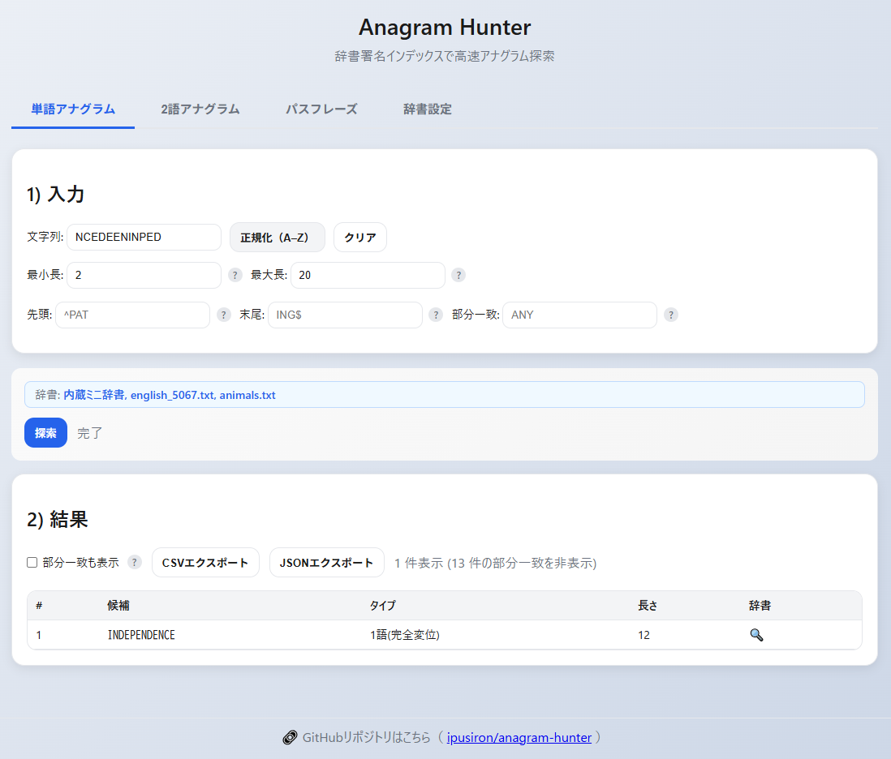

<!--
---
id: day045
slug: anagram-hunter

title: "Anagram Hunter"

subtitle_ja: "高速アナグラム探索ツール"
subtitle_en: "Fast Anagram Search Tool"

description_ja: "辞書照合と署名インデックスを用いて、入力文字列から単語・2語のアナグラムを高速に探索するWebツール"
description_en: "A web tool that rapidly finds single-word and two-word anagrams from input strings using dictionary lookup and signature indexing"

category_ja:
  - 暗号解読
  - 文字列解析
category_en:
  - Cryptanalysis
  - String Analysis

difficulty: 2

tags:
  - anagram
  - dictionary
  - beam-search
  - signature-index
  - frequency-vector

repo_url: "https://github.com/ipusiron/anagram-hunter"
demo_url: "https://ipusiron.github.io/anagram-hunter/"

hub: true
---
-->

# Anagram Hunter - 高速アナグラム探索ツール


[](https://ipusiron.github.io/anagram-hunter/)

**Day045 - 生成AIで作るセキュリティツール100**

**Anagram Hunter** は、アナグラム（並べ替え語）を **辞書照合＋署名インデックス** で高速に抽出するWebツールです。

---

## 🔗 デモページ

👉 [https://ipusiron.github.io/anagram-hunter/](https://ipusiron.github.io/anagram-hunter/)

---

## 📸 スクリーンショット

>
>
>*アナグラム解読*

---

## 主な機能

### 🎯 探索機能
- **単語アナグラム**：入力文字列（A–Z）から辞書一致する全アナグラムを列挙
- **2語アナグラム**：ビーム探索で2語組み合わせのアナグラムを高速探索
- **部分一致フィルター**：完全変位のみ表示、または部分使用も含めて表示を切り替え可能

### 🔍 検索フィルター
- **長さフィルター**：最小長・最大長で結果を絞り込み
- **パターンマッチ**：先頭文字列・末尾文字列・部分一致で絞り込み
- **ヘルプ機能**：各フィルターに「？」アイコンでツールチップ表示

### 📚 辞書管理
- **複数辞書対応**：内蔵辞書＋複数の外部辞書を同時使用可能
- **チェックボックス選択**：使用する辞書を個別にオン/オフ切り替え
- **ローカルファイル読み込み**：TXTファイル（1行=1単語）をドラッグ&ドロップ
- **リモート読み込み**：相対パスでfetch取得（GitHub Pages対応）
- **統計表示**：単語数・署名数をリアルタイム表示

### 🎨 UI/UX
- **タブ式インターフェイス**：単語アナグラム・2語アナグラム・パスフレーズ・辞書設定の4タブ
- **ライトモード**：見やすい明るいデザイン
- **辞書リンク**：結果から英辞郎へ直接ジャンプ（🔍ボタン）
- **リアルタイム更新**：辞書変更時に即座に探索ボタン上の適用辞書名を更新

### 📤 エクスポート機能
- **CSV/JSON出力**：検索結果をファイル形式で保存
- **タブ別エクスポート**：各タブの結果を個別にエクスポート可能

---

## 使い方

### 基本的な流れ
1. **辞書設定**：辞書設定タブで使用する辞書を選択・読み込み
2. **文字列入力**：探索したい文字列を入力（例：`LISTEN`）
3. **フィルター設定**：必要に応じて長さやパターンフィルターを設定
4. **探索実行**：探索ボタンをクリック
5. **結果確認**：結果テーブルで候補を確認、🔍ボタンで意味を調べる

### 辞書の追加方法
- **ローカルファイル**：辞書設定タブでTXTファイルを選択して読み込み
- **リモートファイル**：相対パス（例：`wordlists/animals.txt`）を入力してfetch
- **複数辞書**：内蔵辞書は常時利用可能、追加辞書は個別にオン/オフ可能

### 付属辞書
- `wordlists/animals.txt`：動物名辞書（694語）
- `wordlists/english_5067.txt`：一般英単語辞書（5067語）
- `wordlists/security.txt`：セキュリティ・暗号用語辞書（1000語以上）

---

## 入力と正規化
- 入力は **A–Z のみ**使用（他の文字は自動削除し大文字化）
- 辞書もA–Zのみで正規化して登録（重複は自動除去）

---

## 技術仕様

### アルゴリズム
- **署名インデックス**：文字をソートした文字列（例：LISTEN→EILNST）で高速検索
- **頻度ベクトル**：26次元ベクトルで文字包含チェック
- **ビーム探索**：2語アナグラムで探索空間を制御

### 2語アナグラム探索
- 1語目候補を文字包含チェックで事前絞り込み
- 残差ベクトル計算で2語目候補を効率的に照合
- ビーム幅・上位N件で計算量を制御

---

## ディレクトリー構成

```
/ anagram-hunter
├─ index.html          # メインHTML
├─ style.css           # スタイルシート
├─ script.js           # JavaScriptロジック
├─ CLAUDE.md           # Claude Code用設定
└─ wordlists/          # 辞書ファイル
   ├─ animals.txt      # 動物名辞書（694語）
   ├─ english_1842.txt # 英単語辞書（1842語）
   ├─ english_5067.txt # 英単語辞書（5067語）
   └─ security.txt     # セキュリティ・暗号用語辞書（1000語以上）
```

---

## 技術説明

このツールは教育目的で設計されており、アナグラム探索アルゴリズムの理解と実装学習に適しています。辞書管理・正規化ロジック・インデックス構造は、他の文字列解析ツールとの共通化も考慮した設計になっています。

### 📚 詳細なアルゴリズム解説

アナグラム探索の詳細なアルゴリズム・データ構造・計算量分析については、専用ドキュメントをご参照ください：

**👉 [ALGORITHM.md - アナグラム探索アルゴリズム詳細解説](ALGORITHM.md)**

このドキュメントでは以下について詳しく解説しています：
- 署名インデックスと頻度ベクトルの仕組み
- 単語アナグラム・2語アナグラムの探索手法
- ビーム探索による計算量制御
- 最適化技法と実装上の注意点

---

## 今後の拡張予定
- **パスフレーズアナグラム**：3語以上の組み合わせ探索
- **頻度付き辞書**：単語の出現頻度に基づくスコアリング
- **Trie構造**：前方一致フィルターの高速化
- **多言語対応**：日本語アナグラム探索

---

## 📄 ライセンス

MIT License - 詳細は [LICENSE](LICENSE) をご覧ください。

---

## 🛠 このツールについて

本ツールは、「生成AIで作るセキュリティツール100」プロジェクトの一環として開発されました。  
このプロジェクトでは、AIの支援を活用しながら、セキュリティに関連するさまざまなツールを100日間にわたり制作・公開していく取り組みを行っています。

プロジェクトの詳細や他のツールについては、以下のページをご覧ください。

🔗 [https://akademeia.info/?page_id=42163](https://akademeia.info/?page_id=42163)
