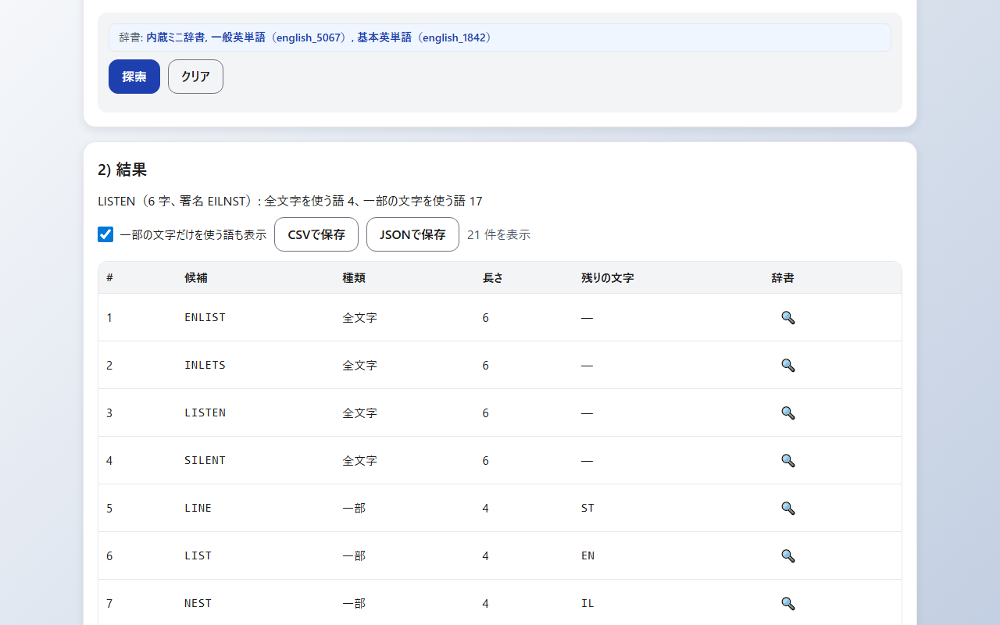
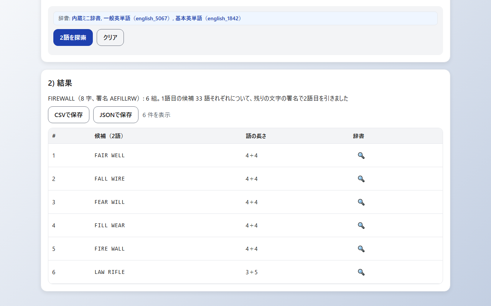
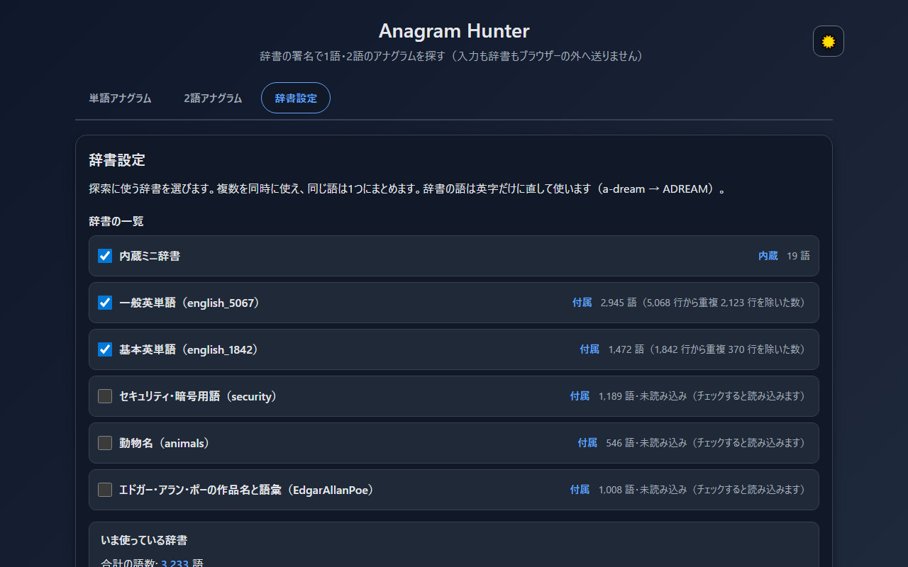

<!--
---
id: day045
slug: anagram-hunter

title: "Anagram Hunter"

subtitle_ja: "辞書の署名で探すアナグラム探索ツール"
subtitle_en: "Anagram Search Tool with Dictionary Signatures"

description_ja: "入力した文字を並べ替えて作れる英単語（1語）と、文字をちょうど使い切る2語の組を、辞書の署名の索引ですべて探すWebツール。入力も辞書もブラウザーの外へ送らない"
description_en: "A web tool that finds every English word (one word) and every two-word combination that can be made by rearranging the input letters, using a dictionary index of letter signatures. Neither the input nor the dictionaries leave the browser"

category_ja:
  - 暗号解読
  - 文字列解析
category_en:
  - Cryptanalysis
  - String Analysis

difficulty: 2

tags:
  - anagram
  - dictionary
  - signature-index
  - frequency-vector
  - transposition

repo_url: "https://github.com/ipusiron/anagram-hunter"
demo_url: "https://ipusiron.github.io/anagram-hunter/"

hub: true
---
-->

# Anagram Hunter - 辞書の署名で探すアナグラム探索ツール


[](https://ipusiron.github.io/anagram-hunter/)

**Day045 - 生成AIで作るセキュリティツール100**

Anagram Hunterは、入力した文字を並べ替えて作れる英単語（アナグラム）を、辞書から探すWebツールです。文字をABC順に並べ替えた「署名」の索引を使い、1語のアナグラムと、文字をちょうど使い切る2語の組をすべて列挙します。入力も辞書もブラウザーの中だけで扱い、外部へは送りません。

---

## 🌐 デモページ

👉 **[https://ipusiron.github.io/anagram-hunter/](https://ipusiron.github.io/anagram-hunter/)**

ブラウザーで直接お試しいただけます。

---

## 📸 スクリーンショット

>
>
>*LISTENから作れる語。全文字を使う4語と、一部の文字を使う語の残りの文字*

>
>
>*FIREWALLの文字をちょうど使い切る2語の組（全6組）*

>
>
>*付属辞書の一覧と、重複を除いた語数（ダークモード）*

---

## ✨ 主な機能

- 単語アナグラム: 入力の文字をすべて使う語（例: LISTEN → SILENT・ENLIST・INLETS）と、一部の文字だけを使う語を列挙する。一部を使う語には、使わずに残る文字を添える
- 2語アナグラム: 入力の文字をちょうど使い切る2語の組を、取りこぼしなく探す（例: DORMITORY → DIRTY ROOM）。同じ組は1回だけ数える
- 絞り込み: 語の最小・最大の長さ、先頭・末尾の文字列、含む文字列。表示の上限（既定200件）
- 辞書: 内蔵ミニ辞書と付属辞書5本を一覧から選んで使う。自分の辞書はテキストファイルか貼り付けで足せる。複数の辞書を同時に使え、同じ語は1つにまとめる
- 入力の正規化: 英字だけを大文字にそろえて使う。全角英字（ＬＩＳＴＥＮ）やアクセント記号つきの字（café → CAFE）も受け付け、無視した文字の数を知らせる
- 書き出し: 結果をCSV（Excelで開けるBOMつき）とJSONで保存する。表示の上限に関係なく全件を書き出す
- 辞書で調べる: 結果の🔍から英辞郎の検索結果を新しいタブで開く
- 画面: ライト／ダークモード（OSの設定に従い、ボタンでも切り替え）、キーボードで操作できるタブ、幅320pxのスマートフォンでも横にはみ出さない

---

## 📖 使い方

1. 「単語アナグラム」タブで、文字列（例: `LISTEN`）を入力して「探索」を押す（Enterキーでも探索できる）
2. 「一部の文字だけを使う語も表示」をオンにすると、入力の一部から作れる語と、残りの文字も並ぶ
3. 「2語アナグラム」タブでは、文字をちょうど使い切る2語の組を探す。人名やフレーズを入れて、並べ替えの候補を見るときに使う
4. 「辞書設定」タブで、使う辞書をチェックで選ぶ。付属辞書はチェックした時点で読み込む。自分の語の一覧（1行に1語）は、ファイルか貼り付けで追加する
5. 結果は「CSVで保存」「JSONで保存」で書き出せる

公開版（HTTPS）で開くと、一般英単語の付属辞書2本（english_5067・english_1842）を最初から読み込みます。

---

## 📚 付属辞書

`wordlists/`のテキストファイル（1行に1語）です。語数は、英字だけに直して重複を除いたあとの数です。

| ファイル | 内容 | 行数 | 語数 | 最初から使う |
|---|---|---|---|---|
| english_5067.txt | 一般英単語 | 5,068 | 2,945 | ○ |
| english_1842.txt | 基本英単語（よく使う語の順） | 1,842 | 1,472 | ○ |
| security.txt | セキュリティ・暗号用語 | 1,189 | 1,189 | |
| animals.txt | 動物名 | 695 | 546 | |
| EdgarAllanPoe.txt | エドガー・アラン・ポーの作品名と語彙 | 1,197 | 1,008 | |
| 12dicts-3of6game.txt | 大きい英単語辞書（12dicts、活用形を含む） | 64,662 | 64,662 | |

- 内蔵ミニ辞書（19語、LISTEN・STONE・TEAMなどのアナグラムの例）は読み込みなしで使える
- 作品名のハイフンは外して1語として扱う（`a-dream`と`adream`は同じ語になる）

---

## 🔬 探索の仕組み

アナグラムどうしは、文字をABC順に並べ替えると同じ文字列になります（LISTEN → EILNST、SILENT → EILNST）。この文字列を署名と呼び、辞書を読み込むときに「署名 → 語の一覧」の索引を作ります。

- 1語: 入力の文字の個数（A〜Zの26文字それぞれの数＝頻度ベクトル）で、辞書の各語が作れるかを確かめる。全文字を使う語は、署名が入力と同じ語である
- 2語: 1語目を選ぶと、2語目に必要な文字（残りの文字）が決まる。残りの文字の署名で索引を引けば、2語目はすべて見つかる。辞書を1回なめるだけで、取りこぼしのない全探索になる

付属辞書を最初から使う状態（内蔵＋english_5067＋english_1842、3,233語）で、次の組が見つかります。

| 入力 | 2語の組 |
|---|---|
| DORMITORY | DIRTY ROOM |
| DEBITCARD | CARD DEBIT, BAD CREDIT, BAD DIRECT |
| SCHOOLMASTER | MASTER SCHOOL, SCHOOL STREAM, CLASSROOM THE |
| FIREWALL | FAIR WELL, FALL WIRE, FEAR WILL, FILL WEAR, FIRE WALL, LAW RIFLE |

組の2語はABC順に並べ、短いほうの語が長い組から先に出します。詳しい手順と計算量は[ALGORITHM.md](ALGORITHM.md)にまとめています。

---

## 🎯 ユースケース

- 転置式暗号の学習: 転置式暗号は文字の位置を入れ替えるだけなので、暗号文は平文のアナグラムになる。短い暗号文を2語の組に並べ替えて平文の候補を探し、縦列転置の仕組みは[Columnar CipherLab（Day043）](https://ipusiron.github.io/columnar-cipherlab/)で確かめる
- CTF・謎解きの問題: 問題文の単語を並べ替えると答えになる、という型のヒントを、1語・2語で確かめる。出題する側は、答えの語にほかの並べ替えがないか（別解）を調べられる
- OSINTの練習: ハンドル名やペンネームが、別の名前の並べ替えになっていないかを探す。自分で作った候補の名前の一覧を辞書として貼り付けて使える。見つかっても同一人物の証拠にはならず、手がかりの1つにとどまる
- 英語の授業・自習: 1つの語の文字から作れる語を探す語彙ゲームに使う（LISTENからは21語）。残りの文字の列を見ながら、次の語を考えられる
- 情報・アルゴリズムの授業: 総当たりと索引の違いを実物で見る。2語の探索では「1語目の候補の数」と、それぞれで署名を1回引くだけで済むことが結果の上に出る
- 創作・趣味: ペンネームやキャラクター名、チーム名を、元の名前の文字から作る。クロスワードやパズルの作問、結婚式の余興で二人の名前を並べ替える遊びにも使える
- 仕事の名前づくり: 製品名・プロジェクト名の候補を、社名や既存の語の文字から出す（商標などの確認は別に行う）
- 自分の用語集で: 専門用語集や社内の用語集を貼り付けて探す。辞書はブラウザーの外へ送らないので、公開していない名前も入れられる
- ポーと暗号: 付属のポーの作品名と語彙で、作品名の文字の並べ替えを探す。ポーは短編『黄金虫』で暗号を題材にした作家で、[Cipher Clairvoyance（Day044）](https://ipusiron.github.io/cipher-clairvoyance/)など、古典暗号のツールと合わせて読める

---

## 🔒 セキュリティとプライバシー

- 入力した文字・読み込んだ辞書は、ブラウザーの中だけで扱う。サーバーへの送信や保存はしない（ページを閉じると辞書は消える）
- Content Security Policy（meta）で、スクリプト・スタイル・通信先を同じサイトに限る。インラインのスクリプトやイベントハンドラーは使わない
- 辞書名（ファイル名）や結果は、すべて`textContent`で画面に入れる（HTMLとして解釈しない）
- 付属辞書は一覧にあるファイルだけを読む。自分の辞書はファイル選択か貼り付けで渡す（任意のURLは読まない）
- 読み込むファイルは10MB・50万語まで
- 英辞郎へのリンクは`rel="noopener noreferrer"`で開き、参照元も送らない

---

## ⚠️ 注意と限界

- 対象は英字（A〜Z）だけである。日本語（かな）のアナグラムは扱わない
- 見つかる語は辞書しだいである。小さい付属辞書5本は合わせても5,214語（内蔵ミニ辞書を含む）で、大きい英単語辞書（64,662語）を足すと候補が大きく増える。固有名詞は出ない
- 結果は語のよく使われる順には並ばない。意味の通る組かどうかは人が判断する
- 2語までを探す。3語以上の組は扱わない
- ファイルとして直接開く（file://）と、ChromeやEdgeではツールが起動しない（ES modulesを読み込めないため）。Firefoxでは起動するが、付属辞書は読み込めない。下の「動作環境」の手順でHTTPから開く

---

## 🧪 テスト

ロジック（`js/anagram-core.js`など）はDOMに依存しないモジュールにしてあり、Node.jsの標準のテスト（`node:test`）で検証します。依存パッケージはありません。

```bash
npm test
```

- Node.js 22以上
- GitHub Actionsで、pushとプルリクエストのたびに自動で実行する
- 2語の探索が総当たりと同じ組を返すこと、付属辞書の語数、このREADMEの表（付属辞書と2語の組）もテストで検証する
- index.htmlのCSP・ラベル・タブの役割、配色のコントラスト（ライト・ダークとも4.5:1以上）も検証する

---

## 📁 ディレクトリー構造

```
anagram-hunter/
├── .github/                  # GitHubの設定
│   └── workflows/            # GitHub Actionsのワークフロー
│       └── test.yml          # pushとプルリクエストでnpm testを実行
├── assets/                   # 画像
│   ├── favicon.svg           # ファビコン
│   ├── screenshot.png        # スクリーンショット（単語アナグラム）
│   ├── screenshot2.png       # スクリーンショット（2語アナグラム）
│   └── screenshot3.png       # スクリーンショット（辞書設定・ダーク）
├── js/                       # 画面以外のモジュール
│   ├── anagram-core.js       # 探索のロジック（正規化・署名・1語・2語・CSV）
│   ├── file-check.js         # file://で起動できなかったときの案内
│   ├── i18n.js               # 画面の言語（日本語・英語）の決定と切り替え
│   ├── messages.js           # 画面に出す文言
│   ├── params.js             # URLの?text=・?tab=で入力を受け取る
│   ├── tabs.js               # タブの切り替え（キーボード操作を含む）
│   ├── theme-init.js         # 読み込みの最初にテーマを当てる
│   ├── theme.js              # ライト／ダークの切り替え
│   └── wordlists.js          # 内蔵ミニ辞書と付属辞書の一覧
├── test/                     # テスト（node:test）
│   ├── contrast.test.js      # 配色のコントラスト・入力欄と操作の大きさ
│   ├── core.test.js          # 正規化・署名・絞り込み・1語・2語・CSV
│   ├── format.test.js        # 行の長さ・制御文字・行数の下限
│   ├── html.test.js          # CSP・要素のid・タブの役割・ラベル
│   ├── i18n.test.js          # 日英の辞書のキー・英語に日本語がないこと・初期の言語
│   ├── messages.test.js      # 文言の置き場所とキー
│   ├── params.test.js        # ?text=・?tab=の読み取り
│   ├── phrase.test.js        # フレーズ・位置の指定・2つの比較・大きい辞書
│   ├── readme.test.js        # READMEの表・構成・ツリー・画像
│   └── wordlists.test.js     # 付属辞書の語数と既知解答
├── wordlists/                # 付属辞書（1行に1語）
│   ├── 12dicts-3of6game.txt  # 大きい英単語辞書（12dicts 3of6game、公有）
│   ├── 12dicts-NOTICE.md     # 12dictsの出典・ライセンス・SHA-256
│   ├── EdgarAllanPoe.txt     # エドガー・アラン・ポーの作品名と語彙
│   ├── animals.txt           # 動物名
│   ├── english_1842.txt      # 基本英単語
│   ├── english_5067.txt      # 一般英単語
│   └── security.txt          # セキュリティ・暗号用語
├── .gitignore                # Gitの除外設定
├── .nojekyll                 # GitHub PagesでJekyllを使わない指定
├── ALGORITHM.md              # 探索アルゴリズムの解説
├── CLAUDE.md                 # Claude Code向けの開発メモ
├── LICENSE                   # ライセンス（MIT）
├── README.md                 # 本ドキュメント
├── index.html                # 画面
├── package.json              # npm testの設定（依存なし）
├── script.js                 # 画面の処理（ES module）
└── style.css                 # スタイル（ライト・ダーク）
```

---

## 💻 動作環境

- Chrome・Edge・Firefoxの最新版で動作を確認している（Safariは未確認）
- 公開版（[https://ipusiron.github.io/anagram-hunter/](https://ipusiron.github.io/anagram-hunter/)）をそのまま使える
- 手元で動かすときは、フォルダーで`python -m http.server 8000`などを実行し、`http://localhost:8000/`で開く

---

## 📄 ライセンス

- ソースコードのライセンスは`LICENSE`ファイルを参照してください。

---

## 🛠️ このツールについて

本ツールは、「生成AIで作るセキュリティツール100」プロジェクトの一環として開発されました。
このプロジェクトでは、AIの支援を活用しながら、セキュリティに関連するさまざまなツールを100日間にわたり制作・公開していく取り組みを行っています。

プロジェクトの詳細や他のツールについては、以下のページをご覧ください。

🔗 [https://akademeia.info/?page_id=42163](https://akademeia.info/?page_id=42163)
